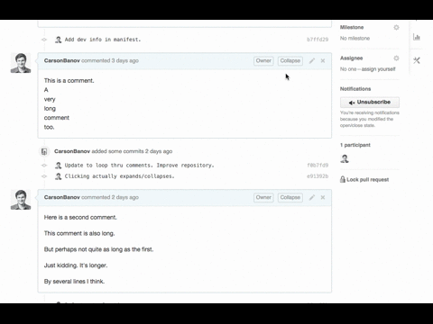

# Github Mark Read Complete Comments

## What?

This extension will insert a button into github pull request pages that will
allow you to collapse comments to improve the readability of a PR timeline. The
collapsed/expanded state will be preserved on page navigation.

## Why?

Why you should use:
  * many or large comments cluttering your PR view even tho you have read and dealt with the content of those comments
  * someone commented "Sweet" or "Thanks!" or just a few emoji icons and you don't want to hurt their feelings by deleting the comment
  * you want to focus on one comment at a time as you go through the PR
  * some comments have become outdated over time and are no longer applicable
  * some comments about code were made as general comments (not on a line of code) so they do not automatically collapse even though you have modified the code in question

Why you should not use:
  * hiding useful comments may cause you to miss things
  * if someone edits a comment I'm not sure what happens (probably will stay hidden)
  * there are more typos than tests in this repo

## How?

* clone this repo
* follow [these instructions](https://developer.chrome.com/extensions/getstarted#unpacked) to load the extension into Chrome
* navigate to a github pull request (that has comments!) where the extension will be active
* you will see a button just to the left of the edit comment button that gives the ability to expand or collapse a comment
